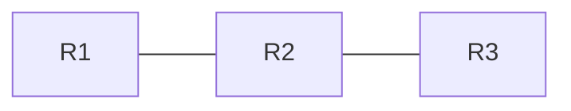
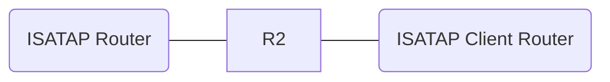

[本文接上一篇](ipv6.html)

<!--more-->

## DHCPv6 配置

### 有状态 DHCPv6 配置

**四步方式**

Server 端

```sh
# 启用 IPv6 单播路由功能
Server(config)#ipv6 unicast-routing
# 创建 IPv6 地址池
Server(config)#ipv6 dhcp pool <pool name>
# 配置 DHCPv6 地址池中的地址前缀、前缀长度、生存时间及首选生存时间
Server(config-dhcpv6)#address prefix <address prefix>/<prefix length> [lifetime <Seconds>] [Preferred lifetime]
# 配置 DHCPv6 地址池中的其它参数（如 DNS、Domain Name 等）
Server(config-dhcpv6)#dns-server <DNS Server ipv6 address>
Server(config)#interface e0/0
Server(config-if)#ipv6 enable
Server(config-if)#ipv6 dhcp server <pool name>
Server(config-if)#ipv6 nd managed-config-flag
Server(config-if)#ipv6 nd other-config-flag
Server(config-if)#no shutdown
```

Client 端配置

```sh
Client(config)#interface e0/0
Client(config-if)#ipv6 enable
Client(config-if)#ipv6 address dhcp
Client(config-if)#no shutdown
```

检测

```sh
show ipv6 dhcp
# 服务器
Server#show ipv6 dhcp binding
Server#debug ipv6 dhcp detail
# 客户端
Client#show ipv6 interface e0/0 # 可以看见获取的 dhcp 信息 
```

**两步方式**

Sever 端

```sh
Server(config)#ipv6 unicast-routing
Server(config)#ipv6 dhcp pool <pool name>
Server(config-dhcpv6)#address prefix <address prefix>/<prefix length> [lifetime <Seconds>] [Preferred lifetime]
Server(config-dhcpv6)#dns-server <DNS Server ipv6 address>
Server(config)#interface e0/0
Server(config-if)#ipv6 enable
Server(config-if)#ipv6 dhcp server <pool name> <rapid-commit>
Server(config-if)#no shutdown
```

Client 端

```sh
Client(config)#ipv6 unicast-routing
Client(config)#interface e0/0
Client(config-if)#ipv6 enable
Client(config-if)#ipv6 address dhcp <rapid-commit>
Client(config-if)#no shutdown
```

debug 信息：

```sh
*Aug 28 08:45:52.529: IPv6 DHCP: Received RELEASE from FE80::A8BB:CCFF:FE00:2000 on Ethernet0/0
*Aug 28 08:45:52.529: IPv6 DHCP: detailed packet contents
*Aug 28 08:45:52.529:   src FE80::A8BB:CCFF:FE00:2000 (Ethernet0/0)
*Aug 28 08:45:52.529:   dst FF02::1:2
*Aug 28 08:45:52.529:   type RELEASE(8), xid 16389289
*Aug 28 08:45:52.529:   option ELAPSED-TIME(8), len 2
*Aug 28 08:45:52.529:     elapsed-time 0
*Aug 28 08:45:52.529:   option CLIENTID(1), len 10
*Aug 28 08:45:52.529:     00030001AABBCC002000
*Aug 28 08:45:52.529:   option SERVERID(2), len 10
*Aug 28 08:45:52.529:     00030001AABBCC001000
*Aug 28 08:45:52.529:   option IA-NA(3), len 40
*Aug 28 08:45:52.529:     IAID 0x00030001, T1 0, T2 0
*Aug 28 08:45:52.529:     option IAADDR(5), len 24
*Aug 28 08:45:52.529:       IPv6 address 2001:1234::E495:C1E3:BD0F:B0BF
*Aug 28 08:45:52.529:       preferred 2121212121, valid INFINITY
*Aug 28 08:45:52.529: IPv6 DHCP: Using interface pool aaa
*Aug 28 08:45:52.529: IPv6 DHCP: Found address 2001:1234::E495:C1E3:BD0F:B0BF in binding for FE80::A8BB:CCFF:FE00:2000, IAID 00030001
*Aug 28 08:45:52.529: IPv6 DHCP: Freeing address 2001:1234::E495:C1E3:BD0F:B0BF to internal pool 2001:1234::/64
*Aug 28 08:45:52.529: IPv6 DHCP: Freeing IA_NA 00030001 from binding for FE80::A8BB:CCFF:FE00:2000
*Aug 28 08:45:52.529: IPv6 DHCP: Freeing binding for FE80::A8BB:CCFF:FE00:2000 from pool aaa
*Aug 28 08:45:52.529: IPv6 DHCP: Source Address from SAS FE80::A8BB:CCFF:FE00:1000
*Aug 28 08:45:52.529: IPv6 DHCP: detailed packet contents
*Aug 28 08:45:52.529:   src FE80::A8BB:CCFF:FE00:1000
*Aug 28 08:45:52.529:   dst FE80::A8BB:CCFF:FE00:2000 (Ethernet0/0)
*Aug 28 08:45:52.529:   type REPLY(7), xid 16389289
*Aug 28 08:45:52.529:   option SERVERID(2), len 10
*Aug 28 08:45:52.529:     00030001AABBCC001000
*Aug 28 08:45:52.529:   option CLIENTID(1), len 10
*Aug 28 08:45:52.529:     00030001AABBCC002000
*Aug 28 08:45:52.529:   option STATUS-CODE(13), len 9
*Aug 28 08:45:52.529:     status code SUCCESS(0)
*Aug 28 08:45:52.529:     status message: SUCCESS
*Aug 28 08:45:52.529: IPv6 DHCP: Sending REPLY to FE80::A8BB:CCFF:FE00:2000 on Ethernet0/0
------------------
*Aug 28 08:46:43.438: IPv6 DHCP: Received SOLICIT from FE80::A8BB:CCFF:FE00:2000 on Ethernet0/0
*Aug 28 08:46:43.438: IPv6 DHCP: detailed packet contents
*Aug 28 08:46:43.438:   src FE80::A8BB:CCFF:FE00:2000 (Ethernet0/0)
*Aug 28 08:46:43.438:   dst FF02::1:2
*Aug 28 08:46:43.438:   type SOLICIT(1), xid 16439140
*Aug 28 08:46:43.438:   option ELAPSED-TIME(8), len 2
*Aug 28 08:46:43.438:     elapsed-time 0
*Aug 28 08:46:43.438:   option CLIENTID(1), len 10
*Aug 28 08:46:43.438:     00030001AABBCC002000
*Aug 28 08:46:43.438:   option RAPID-COMMIT(14), len 0
*Aug 28 08:46:43.438:   option ORO(6), len 4
*Aug 28 08:46:43.438:     DNS-SERVERS,DOMAIN-LIST
*Aug 28 08:46:43.438:   option IA-NA(3), len 12
*Aug 28 08:46:43.438:     IAID 0x00030001, T1 0, T2 0
*Aug 28 08:46:43.438: IPv6 DHCP: Using interface pool aaa
*Aug 28 08:46:43.438: IPv6 DHCP: Creating binding for FE80::A8BB:CCFF:FE00:2000 in pool aaa
*Aug 28 08:46:43.438: IPv6 DHCP: Allocating IA_NA 00030001 in binding for FE80::A8BB:CCFF:FE00:2000
*Aug 28 08:46:43.438: IPv6 DHCP: Looking up pool 2001:1234::/64 entry with username '00030001AABBCC00200000030001'
*Aug 28 08:46:43.438: IPv6 DHCP: Poolentry for user not found
*Aug 28 08:46:43.438: IPv6 DHCP: Allocated new address 2001:1234::155B:80D5:B458:9F16
*Aug 28 08:46:43.438: IPv6 DHCP: Allocating address 2001:1234::155B:80D5:B458:9F16 in binding for FE80::A8BB:CCFF:FE00:2000, IAID 00030001
*Aug 28 08:46:43.438: IPv6 DHCP: Updating binding address entry for address 2001:1234::155B:80D5:B458:9F16
*Aug 28 08:46:43.438: IPv6 DHCP: Source Address from SAS FE80::A8BB:CCFF:FE00:1000
*Aug 28 08:46:43.438: IPv6 DHCP: detailed packet contents
*Aug 28 08:46:43.438:   src FE80::A8BB:CCFF:FE00:1000
*Aug 28 08:46:43.438:   dst FE80::A8BB:CCFF:FE00:2000 (Ethernet0/0)
*Aug 28 08:46:43.438:   type REPLY(7), xid 16439140
*Aug 28 08:46:43.438:   option SERVERID(2), len 10
*Aug 28 08:46:43.438:     00030001AABBCC001000
*Aug 28 08:46:43.438:   option CLIENTID(1), len 10
*Aug 28 08:46:43.438:     00030001AABBCC002000
*Aug 28 08:46:43.438:   option RAPID-COMMIT(14), len 0
*Aug 28 08:46:43.438:   option IA-NA(3), len 40
*Aug 28 08:46:43.438:     IAID 0x00030001, T1 1060606060, T2 1696969696
*Aug 28 08:46:43.438:     option IAADDR(5), len 24
*Aug 28 08:46:43.438:       IPv6 address 2001:1234::155B:80D5:B458:9F16
*Aug 28 08:46:43.438:       preferred 2121212121, valid INFINITY
*Aug 28 08:46:43.438: IPv6 DHCP: Sending REPLY to FE80::A8BB:CCFF:FE00:2000 on Ethernet0/0
```

### 无状态 DHCPv6 配置

Sever 端

```sh
Server(config)#ipv6 unicast-routing
Server(config)#ipv6 dhcp pool <pool name>
Server(config-dhcpv6)#address prefix <address prefix>/<prefix length> [lifetime <Seconds>] [Preferred lifetime]
Server(config-dhcpv6)#dns-server <DNS Server ipv6 address>
Server(config)#interface e0/0
Server(config-if)#ipv6 enable
Server(config-if)#ipv6 dhcp server <pool name> <rapid-commit>
# 关闭接口发送 RA 消息的能力
Server(config-if)#ipv6 nd ra suppress
Server(config-if)#no shutdown
```

Router 端

```sh
Router(config)#interface e0/0
Router(config-if)#ipv6 enable
Router(config-if)#ipv6 address <address>/<prefix>
# 设置O比特的值为1(M比特的值默认为0)
Router(config-if)#ipv6 nd other-config-flag
```

Client 端

```sh
Client(config)#ipv6 unicast-routing
Client(config)#interface e0/0
# 接口IPv6功能，可以生成链路本地地址
Client(config-if)#ipv6 enable
# 启用无状态地址自动配置功能
Client(config-if)#ipv6 address autoconfig
Client(config-if)#no shutdown
```

检测

```sh
Router#debug ipv6 nd
Server#debug ipv6 dhcp detail
Client#show ipv6 dhcp interface e0/0
```

### DHCPv6 中继配置

Server 端与[有状态 DHCPv6](#有状态 DHCPv6 配置) 的 Server 端同。

Relay 端

```sh
Relay(config)#interface e0/1
# 在连接 Client 的接口中指定服务器地址
Relay(config-if)#ipv6 dhcp relay destination <Server ipv6 address>
```

Client 端与[有状态 DHCPv6](#有状态 DHCPv6 配置) 的 Client 端同。

### DHCPv6 PD 配置

Prefix Delegation，前缀代理，

```sh
# 指定前缀授权时使用本地地址池中的地址前缀
PDServer(config-dhcpv6)#prefix-delegation pool <localpool name> [lifetime <Seconds>] [Preferred lifetime]
# 使用指定的地址前缀对特定 DUID 的设备做前缀授权
PDServer(config-dhcpv6)#prefix-delegation <prefix/prefix length> <DUID value>


PDClient(config-if)#ipv6 address autoconfig default
# 基于 PD 功能使能 DHCPv6 客户端
PDClient(config-if)#ipv6 dhcp client pd <name>
# 将指定的 16 进制组的值放在通过 PD 获取的前缀后面，形成接口的 IPv6 地址
PDClient(config-if)#ipv6 address <name> <::X:X:X:X/prefix length> 
```

## IPv6 路由协议介绍

- 静态路由
- RIPng
- EIGRP for IPv6
- OSPFv3
- ISIS for IPv6
- MP-BGP4

### 静态路由

```sh
# 启用IPv6单播路由功能（默认关闭）
Router(config)#ipv6 unicast-routing
# 配置IPv6静态路由
RouterX(cofig)#ipv6 route <目的IPv6网络前缀>/<前缀长度> [本地出站接口编号] [下一跳IPv6地址] [管理距离值]
```

配置案例，下列方式均可以。

```
ipv6 route 2003::/64 e0/0
ipv6 route 2003::/64 2001::2
ipv6 route 2003::/64 e0/0 2001::2

```

#### 浮动静态路由

```sh
R1(config)#ipv6 route 2003::/64 e0/1 2010::2 10 
R2(config)#ipv6 route 2002::/64 e0/1 2010::1 10 
# 默认为 1，手动修改为 10，相当于优先级调高
```

#### 递归静态路由

下一跳迁移操作时简单。



```
ipv6 route 2011::/64 2002::2 
ipv6 route 2002::/64 e0/0 2001::2 

```

#### 缺省路由

```sh
RouterX(config)#ipv6 route ::/0 [本地出站接口编号] [下一跳IPv6地址] [管理距离值]
```

**练习：**

```
A---R1===R2---B

拓扑大致如上
要求：
主机 A 的 ipv6 地址通过无状态 DHCPv6 获取
R1 配置成 A 的 DHCP 服务器
主机 B 的 IPv6 地址采用无状态地址自动获取（SLAAC，StateLess Address AutoConfig）。
R1 R2 双线连接，优选下面的路径为最佳路径。
ipv6  R1 R2 上 IPv6 地址前缀 2001:aa00:bb00:cc00::/64
ipv6  R1 R2 下 IPv6 地址前缀 2001:dd00:ee00:ff00::/64
R1 a 2001:1:2:3::/64
R2 b 2011:11:22:33::/64

```

### RIPng

下一代的 RIP，基于 RIPv2 开发

与 RIPv2 的相同点

- 更新机制相同---增量触发更新
- 更新报文类型相同：默认采用组播发送更新
- 消息类型相同：request、response
- 计时器相同：无效计时器、垃圾收集计时器、抑制计时器
- 度量值相同：跳数（16跳为无穷大，不可达）

区别

- 不向下兼容

- 更新报文的目的地址为 `FF02::9`

- 无验证功能

- 端口号不同：

  > RIPv1、RIPv2： UDP 520
  > RIPng： UDP 521

#### RIPng 报文格式

```
 在 RIPv2 中，每一个路由条目中包含对应的下一跳地址。

 在 RIPng 中，使用专门的路由条目指定下一跳地址，并把所有使用这个下一跳地址的路由条目编成组，跟在这个路由条目的后边。
```

#### RIGng 配置

```sh
# 创建RIPng进程
Router(config)#ipv6 router rip <进程名称>
# 进入接口下，将接口加入到 RIPng 进程 
Router(config-if)#ipv6 rip <进程名称> enable
Router#show ipv6 rip # 查看 RIPng 进程
Router#show ipv6 route rip # 查看 IPv6 路由表中 RIPng 的路由
```

#### RIPng 其他配置

```sh
# 修改 RIPng 进程的端口号
Router(config-rtr)#port <端口号> multicast-group <RIPng 组播地址>
```

修改 RIPng 进程的端口号后，可以将一个接口加入到多个 RIPng 进程下 

```sh
# 调整 RIPng 进程路由条目的偏移量，默认值为 1。
Router(config-if)#ipv6 rip <进程名称> metric-offset <度量值的偏移量>
Router(config-if)#ipv6 rip <进程名称> summary-address <IPv6 汇总后前缀>
```

### OSPFv3

关于 IPv4 中的 OSPF 介绍，可参考[这里](ospf.html)。

#### OSPFv3 有如下 IPv6 特征

- 基于 OSPFv2，内部细节做了重大修改
- 分发 IPv6 前缀
- 直接运行在 IPv6 之上
- 同时配置 OSPFv2 和 OSPFv3，彼此完全独立

#### 添加的 IPv6 特殊属性

- 128 位的 IPv6 地址
- 将 IPv6 链路本地地址用作源地址
- 每个接口可以有多个地址和 OSPF 实例
- 认证（支持使用 Ipsec 进行身份认证）
- OSPFv3 运行在链路上而不是子网上

OSPFv3 是一种链路状态路由协议，基于 OSPFv2

#### 与 OSPFv2 的相似之处

- 报文类型（HELLO、DD、LSR、LSU、LSACK）
- 邻居发现机制和邻居关系建立机制相同
- LSA 泛洪和过期机制相同
- SPF 计算方式相同
- DR 选举步骤相同
- 支持多种类型的区域
- 支持多种拓扑（NBMA、P-t-MP、P-t-P、Broadcase)
- Router-ID 仍然是 32 位

```markdown
建立邻居关系需满足：
1. hello 间隔、dead 间隔要一致。在点到点或广播型网络中， hello 报文间隔 10s。非广播多重访问网络（NBMA）中 hello 报文间隔 30s。
2. dead interval 默认是 hello 报文的 4 倍。 40s 或 120s。
3. 区域 id 要一致。v3 增加的实例，除 Area id 一致，还需要 Instance id 相同
4. 验证类型和验证口令要一致
```

#### **OSPFv3 与 OSPFv2 的区别**

1. **每个链路上的协议处理**：允许在一条链路上但属于不同 IPv6 子网的两个邻居交换数据包
2. **取消了寻址概念**：OSPFv3 的路由器 LSA 和网络 LSA 中不再携带IP地址
3. **邻居总是通过路由器 ID 来标识**：在所有类型的链路上都使用 Router ID 来标识邻居
4. **链路本地地址的使用**：使用链路本地地址来作为源和下一跳地址
5. **对每个链路上多个实例的支持**：允许每条链路上具有多个不同的实例，相同实例才可以通信
6. **取消了 OSPF 特有的验证功能**：使用 IPv6 的验证扩展头实现验证
7. **更灵活地处理未知类型的 LSA**：OSPFv2 丢弃未知类型的 LSA；OSPFv3 可以在链路本地范围扩散或像被识别一样保存扩散，但 SPF 算法中被忽略

```
*比喻*
叶子：末端网络
树枝：两台路由器直接的链路
节点：路由器
树根：每天路由器认为自己是树根，自行计算这棵树

```

**OSPFv3 运行在链路，而 OSPFv2 运行在子网**

```
不在路由进程下使用 network 命令，直接在接口上使用 ipv6 ospf process-id area area-id 来指定哪些 IPv6 网络是 OSPFv3 的一部分

```

**使用 Link-Local 地址**

```
OSPFv3 使用 IPv6 的 Link-Local 地址标识 OSPFv3 邻居

因此，当配置 ipv6 ospf neighbor <邻居 IPv6 地址>命令时，邻居 IPv6 地址必须使用邻居的 Link-Local 地址

```

**支持 OSPFv3 多实例**

```
让 OSPFv3 的不同 AS 能够使用共同的链路，同一条链路可以属于多个 area
（可以实现一套拓扑，运行多个网络，彼此分割）
OSPFv3 使用新的字段，称为实例 ID，运行每条链路上有多个实例
两个实例要相互通信，它们的实例 ID 必须相同
默认情况下，实例 ID 为 0

ipv6 ospf <process-id> area area-id [instance instance-id]

```

**组播地址**

FF02::5、FF02::6

**删除 OSPFv2 中的地址语义**

```
IPv6 地址不包含在 OSPFv3 分组报文的头部中
(它是有效负载信息的一部分)
OSPFv3 的路由器 LSA 和网络 LSA 不携带 IPv6 地址
Router ID、Area ID 和链路状态 ID 仍然采用 32 位数值
DR 和 BDR 使用 Router ID，而不是 IP 地址来标识

```

**安全性**

```
OSPFv3 使用 IPv6 拓展报头的 AH 和 ESP，而不是 OSPFv2
定义的各种身份验证和保密机制
身份验证不再是 OSPFv3 的一部分
IPv6 负载确保使用了正确的身份验证

```

**LSA 类型**

Router LSA 只包含 32 位的 ID

OSPFv3 新增的两种类型的 LSA

- Link LSAs
- Intra-area prefix LSAs

OSPFv3 类型 2003 和类型 2009 的 LSA 携带所有 IPv6 前缀信息

OSPFv3 LSA 的作用

```
（1）路由器 LSA（Router-LSA）：描述在特定区域内的路由器接口的链路状态及链路开销。该类型 LSA 仅在接口所在的区域内传播。该类型 LSA 还指示出产生该类型 LSA 的路由器是否是一台 ABR 或 ASBR，以及路由器是否是虚链路的一端。类型 1 LSA 也被用来通告末端（stub）网络。

（2）网络 LSA（Network-LSA）：由 DR 产生，用来描述 DR 所代表的网络的链路状态信息和链路开销信息。该 LSA 是 BMA 网络上的所有链路信息和链路开销信息的集合信息。

（3）区域间前缀 LSA（Inter-Area-Prefix-LSA）：这种类型 LSA 在 OSPFv2 中叫做概括的网络链路状态条目（summary net link states）。该类型 LSA 由 ABR 产生，用来把一个区域内的路由信息通告到另外一个区域。这种类型的 LSA 既可以描述一条具体的路由信息，也可以描述总结的路由信息。在 OSPFv3 中，地址是用前缀和前缀长度表达的，而不再使用地址和掩码的表达形式。缺省路由的前缀长度用 0 代表。

（4）区域间路由器 LSA（Inter-Area-Router-LSA）：由 ASBR 产生，用以通告 ASBR 的位置。试图把数据送达外网的路由器使用该 LSA 确定通往下一跳的最佳路径。

（5）自治系统外 LSA（AS-External-LSA）：用来携带自治系统外路由信息的 LSA。例如，把其它 AS 的路由再发布到 OSPF 中的路由信息。在该类型的 LSA 中，地址用前缀和前缀长度表达，缺省路由的前缀长度用 0 表达。
> 把外部系统的路由通告到内部网络中。传播范围：骨干区域，普通区域。

（6）类型 6 LSA（Group-membership-LSA）：用于组播，不做讨论。
> 组成员 LSA

（7）类型 7 LSA（Type-7 LSA）：由 NSSA 中的 ASBR 产生，只在 NSSA 中传播。在 ABR 上它被转换成类型 5 并且被扩散到骨干区域。
> nssa，not-so-stubby-area，非完全末节区域

（8）链路 LSA（Link-LSA）：该类型 LSA 仅在本链路上传播，具有以下 3 种目的：向本链路上的其它路由器提供路由器的本链路地址；向本链路上的其它路由器通告 IPv6 地址前缀，使其与本链路相关联；允许路由器在该类型 LSA 中插入一些选项比特，与为本链路产生的网络 LSA 相关联。

（9）区域内前缀 LSA（Intra-Area-Prefix-LSA）：该类型 LSA 在本区域内传播，具有以下两种功能之一：通过参考网络 LSA 把 IPv6 地址前缀与转输网络（transit network）相关联；或者通过参考路由器 LSA 把 IPv6 地址前缀与路由器相关联。一台路由器可以为给定的区域产生多个该类型的 LSA，这些 LSA 使用链路状态 ID 字段（Link State ID）区分。DR 为它所代表的链路产生一个或多个该类型的 LSA，向整个区域内通告该链路的地址前缀。

```

#### 配置 OSPFv3 步骤

```
1.启动IPv6单播路由功能
  ipv6 unicast-routing
2.(可选)进入 OSPFv3 路由模式和配置 Router ID
  如已配置 IPv4 地址，则无需特意配置 Router ID
3.在接口上启用 OSPFv3 并将接口加入 OSPFv3 进程
4.(可选)在接口上配置包含 area、优先级和开销
5.(可选)在路由模式下配置特定路由，包含路由汇总、stub 区域特性等

```

```sh
# 参数 process-id 用由路由器本身标识 OSPFv3 进程，范围 1 - 65535 
Router(config)#ipv6 router ospf <process-id>
# 指定 Router ID
Router(config-rtr)#Router-id <X.X.X.X> # X.X.X.X是与IPv4地址格式相同的数值
# 在接口上启用 OSPFv3 实例
Router(config-if)#ipv6 ospf <process-id> area <area-id> [instance instance-id]
# 修改接口开销
Router(config-if)#ipv6 ospf cost <interface-cost> # interface-cost 取值范围 1 - 65535
```

**末节(Stub)与完全末节(Totally Stubby)区域配置**

```sh
# 末节区域
Router(config-rtr)#area area-id stub
# 完全末节区域，仅在区域边界路由器(ABR)上配置 no-summary 该参数将区域定义为完全末节区域
Router(config-rtr)#area area-id stub no-summary
```

**OSPFv3 区域间汇总路由**

```sh
# 在 ABR 的路由模式下：
Router(config-rtr)#area <area-id> range <ipv6-prefix/prefix-length> [advertise|not-advertise] [cost cost]
# ipv6-prefix/prefix-length 汇总路由对应的地址范围的 IPv6 地址和前缀长度
# advertise 指定通告的地址范围，将生成一个 Type3 汇总 LSA
# not-advertise 指定不通告该地址范围，因此各个网络组成部分对其他网络来说是隐藏的
```

```
# OSPFv3 AS 外部路由汇总

本地路由器到外部地址的总和加上从 ASBR 到外部地址的总和

Type1 计算本地到外部


```

**重置 OSPFv3 进程**

触发 SPF 算法重新计算，并重新填充 RIB

```sh
# 在 OSPFv3 AS边界路由器(ASBR)上实现 AS 外部路由汇总
Router(config-rtr)#summary-prefix <summary IPv6 prefix/prefix length>
# 重置 OSPFv3 进程
Router#clear ipv6 ospf [process-id] {counters|neighbor [neighbor-id]}
```

**OSPFv3 检测命令**

```sh
show ipv6 ospf [process-id] [area-id] neighbor # 显示 OSPFv3 邻居信息
show ipv6 ospf [process-id] [area-id] interface xx # 显示 OSPFv3 接口配置信息
show ipv6 ospf [process-id] [area-id] # 显示 OSPFv3 的常规信息
```

**管理距离**

AD，administrative distance

```
直连 0
静态 1
eigrp 90
ospf 110
isis for ipv6 115
ripng 120
eigrp 外部 170
外部bgp(ebgp 20
内部bgp(ibgp 200
未知 255

```

## IPv6 的部署

### IPv6 过渡技术

双协议栈技术

- 同时启用 v4 与 v6 协议栈

隧道技术

- v6 报文封装在 v4 中
- 主流技术

网络地址转换

- NAT－PT（Network Address Translator - Protocol Translator）

多个 IPv6 网络之间互通

- 手工隧道
  - GRE 隧道
  - IPv6 in IPv4 隧道
- 自动隧道
- 6 to 4 隧道
- ISATAP
- 其它隧道技术

IPv6 网络和 IPv4 网络互通

- 双栈主
- NAT - PT
- 其它技术

采用隧道技术来完成互通、IPv6 报文作为 IPv4 的载荷

优点

- 充分利用现有网络
- 骨干网内部设备无须升级

缺点

- 额外的隧道配置
- 效率降低

### GRE 隧道

Generic Routing Encapsulation，通用路由封装。

SVTI：static virtual tunnel interface

R1:

```
ipv6 unicast-routing
interface ethernet 0/0
    ip address 20.1.1.1  255.255.255.0
interface ethernet 0/1
    ipv6 address 2001:1::1/64
    ipv6 rip cisco enable
interface tunnel 0 
    ipv6 address 2001:3::1/64
    ipv6 rip cisco enable
    tunnel source 20.1.1.1
    tunnel destination 20.1.2.1
    tunnel mode gre ip
ip route 20.1.2.0 255.255.255.0 e0/0

```

R2:

```
ipv6 unicast-routing
interface ethernet 0/0
    ip address 20.1.2.1  255.255.255.0
interface ethernet 0/1
    ipv6 address 2001:2::1/64
    ipv6 rip cisco enable
interface tunnel 0 
    ipv6 address 2001:3::2/64
    ipv6 rip cisco enable
    tunnel source 20.1.2.1
    tunnel destination 20.1.1.1
    tunnal mode gre ip
ip route 20.1.1.0 255.255.25.0 e0/0

```

PC1:

```
ipv6 unicast-routing
interface ethernet 0/0
    ipv6 address 2001:1::2/64
    ipv6 rip cisco enable

```

PC2:

```
ipv6 unicast-routing
interface ethernet 0/0
    ipv6 address 2001:2::2/64
    ipv6 rip cisco enable

```

### IPv6 in IPv4 隧道技术

配置与 GRE 隧道基本相同，tunnel 模式不同。

```
interface tunnel 0 
	tunnel mode ipv6ip 

```

### IPv4 兼容 IPv6 自动隧道技术

IPv4 兼容 IPv6 地址:

`0:0:0:0:0:0:A.B.C.D`(前 96 位为 0，后 32 位为 IPv4 地址)

用 IPv6 格式表示 IPv4 地址，适用于不经常性的 IPv6 节点连接需求。不需要为每条隧道预先配置，维护方便。

配置时无需配置 tunnel destination。

```
interface tunnel 0 
	tunnel mode ipv6ip auto-tunnel

```

### 6to4 自动隧道技术

6to4 地址

```
| 16bits |  32bits  |  16bits | 64bits |
|  2002  | IPv4 地址 | 子网标识 | 接口标识 |

```

```
interface tunnel 0 
	tunnel mode ipv6ip 6to4
ipv6 route 2002::/16 tunnel 0

```

### ISATAP 隧道技术

连接 IPv4 网点内部的 IPv6 主机和路由器

将 IPv4 网点作为一个 NBMA 链路，在 IPv4 报文中封装 IPv6 报文

优点

- IPv4 网点内部的 IPv6 主机可自动获得 IPv6 前缀

缺点

- IPv6 地址为固定格式



R1:

```
ipv6 unicast-routing
interface g1/0
    ip address 10.10.10.1  255.255.255.0
interface tunnel 0 
    ipv6 address 2001:DB8:AA10:10::/64 eui-64
    no ipv6 nd ra suppress
    tunnel source g1/0
    tunnel mode ipv6ip isatap
router rip
    version 2
    network 10.0.0.0

```

R3:

```
ipv6 unicast-routing
interface g 1/0
    ip address 172.16.100.3  255.255.255.0
interface tunnel 0 
    ipv6 enable
    ipv6 address autoconfig
    tunnel source g1/0
    tunnel destination 10.10.10.1
    tunnel mode ipv6ip
router rip
    version 2
    network 172.16.0.0

```

Tunnel 口默认开启 `ipv6 nd ra suppress`，需手动关闭

### IPv6 网络和 IPv4 网络互通

双栈技术

- 同时支持 IPv6 和 IPv4 协议
- 应用程序根据 DNS 解析地址类型选择使用 IPv6 或 IPv4 协议

优点

- 互通性好，实现简单，允许应用逐渐从 IPv4 过渡到 IPv6

缺点

- 只适用双栈节点本身
- 对每个 IPv4 节点都要升级，成本较大，没有解决 IPv4 地址紧缺问题

#### **SIIT 技术**

SIIT（Stateless IP/ICMP Translation） 

- 对 IP 和 ICMP 报文进行转换（将 IPv6 报头与 IPv4 报头直接转换）
- IPv6 节点使用`::FFFF:0:a.b.c.d` （翻译地址）
- IPv6 节点访问 IPv4 节点使用`::FFFF:a.b.c.d` （映射地址 ）

#### NAT - PT 原理

通过中间的 NAT - PT 协议转换服务器，实现纯 IPv6 节点和纯 IPv4 节点间的互通

NAT - PT 服务器分配动态 IPv4 地址来标识 IPv6 主机（与 DNS 配合）

NAT - PT 服务器向相邻 IPv6 网络宣告 96 位地址前缀信息，用于标识 IPv4 主机

NAT - PT 服务器负责 IPv4-to-IPv6，或 IPv6-to-IPv4 的报文转换

优点

- 只需设置 NAT - PT 服务器

缺点

- 资源消耗较大，服务器负载重

#### NAT - PT 种类

静态 NAT - PT，提供一对一的 IPv6 地址和 IPv4 地址的映射，配置复杂，使用大量的 IPv4 地址

动态 NAT - PT，只能单向访问到一边的协议栈，但不能反过来访问，是多对多配置

NAPT - PT，也叫做重载，指多对一源地址转换，是 v6 向 v4 的单向访问，不能反过来访问 v6

#### 静态 NAT - PT 配置

R5:

```sh
interface Serial1/0
ipv6 address FE80:1::10 link-local
ipv6 address 10::1/64
ipv6 nat
ipv6 rip rng_1 enable

interface Serial1/1
ip address 1.1.1.1 255.255.255.0
ipv6 nat

ipv6 router rip rng_1
redistribute connected metric 3 # 重分发，注入直连路由，默认跳数 3
no split-horizon

# 前面的地址映射成后面的
ipv6 nat v4v6 source 1.1.1.2 1000::2
ipv6 nat v6v4 source 21::1 100.1.1.2
ipv6 nat prefix 1000::/96
```

```sh
R3#ping 100.1.1.2 sou 1.1.1.2 re 1     
Type escape sequence to abort.
Sending 1, 100-byte ICMP Echos to 100.1.1.2, timeout is 2 seconds:
Packet sent with a source address of 1.1.1.2 
!
Success rate is 100 percent (1/1), round-trip min/avg/max = 36/36/36 ms
```

> NVI 接口，NAT Virtual Interface

可查看 IPv6 NAT - PT 的转译表

```
R5#show ipv6 nat translation
```

练习：

```
R1 R2 OSPFv3
R2 R3 IPv4 默认路由
R1 R2 之间 IPv6地址 2001:1::/64
R2 R3 之间 IP 地址 10.1.1.0
v4 地址映射的地址池前缀 2010::/96
20.1.1.0/24
```

