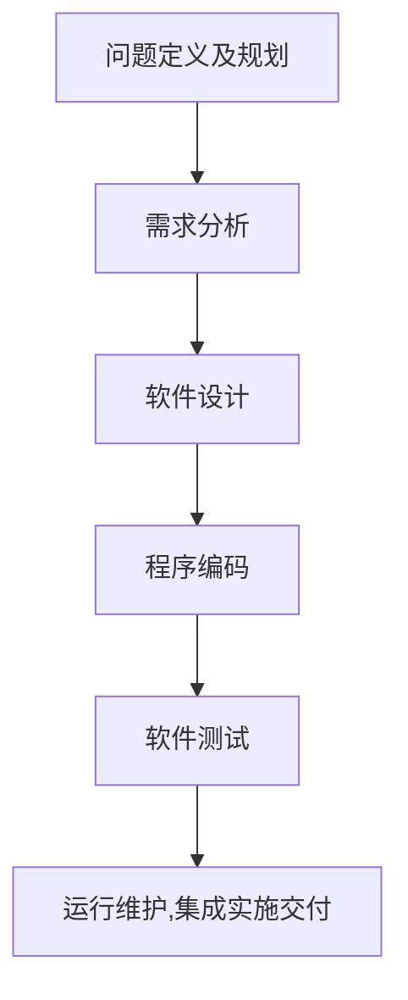

《互联网技术》教材 内容节选

<!--more-->

## 第7章 数据库基础

数据库管理系统（DataBase Management System，DBMS）

数据模型

定义：用来描述数据、组织数据和对数据进行操作。

分类：概念模型（也称信息模型）、逻辑模型（或称数据模型）。

数据模型组成要素：

- 数据结构
- 数据操作
- 数据的完整性约束

概念模型的 E-R 表示方法

概念模型是对现实世界及其联系的抽象表示，是现实世界到计算机的一个中间层次，也称信息模型。比较著名的是 E-R 模型。基本成分包含实体型、属性和联系。

4 种数据模型：层次模型、网状模型、关系模型、面向对象的数据模型。

|                        |      |      |
| ---------------------- | ---- | ---- |
|DBA| DataBase Administrator |  数据库管理员|
|DDL|Data Define Language|数据定义语言|
|DD|Data Dictionary|数据字典|
|DML|Data Manipulation Language|数据操纵语言|

结构化查询语言（Structured Query Language，SQL）是关系代数和关系演算之间的语言。

| SQL 功能 | 动词                   |
| -------- | ---------------------- |
| 数据定义 | CREATE，DROP、ALTER    |
| 数据查询 | SELECT                 |
| 数据操纵 | INSERT、UPDATE、DELETE |
| 数据控制 | GRANT、REVOKE          |

略

MPP 数据库，即大规模并行处理（Massively Parallel Processor），是一种海量数据实时分析架构。

NoSQL（Not Only SQL），不仅仅是 SQL，用于指代那些非关系型的、分布式的，且一般不保证遵循 ACID 原则的数据存储系统。

> ACID：原子性（Atomicity）、一致性（Consistency）、隔离性（Isolation）、持久性（Durability）。事务的 4 个特性。

BASE，Basically Avaiable（基本可用），Soft-state（软状态/柔性事务）、Eventually Consistent（最终一致性）。BASE 模型牺牲高一致性，获得可用性和分区容错性。相对于事务严格的 ACID 特性，NoSQL 数据库保证的是 BASE 特性。

## 第8章 数据存储基础

数据存储概念

数据存储设备

磁盘阵列，全称是独立磁盘冗余阵列（Redundant Arrays of Independent Disks，RAID）或廉价磁盘冗余阵列（Redundant Arrays of Inexpensive Disks，RAID）。利用数据条带化提高性能和利用数据冗余提高可靠性。

硬件 RAID、软件 RAID、软硬结合。

RAID0：条带化（Striping）。RAID1：镜像化（Mirroring）。

安全性`RAID 1+0`好于`RAID 0+1`。

网络存储结构：直接直连存储（Direct Attached Storage，DAS）、网络链接存储（Network Attached Storage，NAS）和存储区域网络（Storage Area Network，SAN）。

备份系统的逻辑结构：备份源系统、备份管理器、备份目标系统。

备份分类：完全备份、增量备份、差分备份。

衡量容灾备份的关键技术指标：数据恢复点目标，恢复时间目标。

## 第9章 软件开发基础

### 9.1 程序设计基础

程序的翻译与执行

**编译方式**是将整段程序进行翻译，把高级语言翻译成等价的机器语言目标程序，然后链接运行。

**解释方式**则不产生完整的目标程序，而是逐句进行，边翻译，边执行。

**编译器处理过程**：词法分析、语法分析、语义分析、中间代码生成、代码优化（非必须）、目标代码生成。

编译方式：

翻译与执行是分开的，直接执行翻译之后的机器代码，执行速度快。同等条件对系统要求低，

解释方式：

翻译一句执行一句，不生成可存储的目标代码。执行速度慢。

| 编译方式                               | 解释方式                                                 |
| -------------------------------------- | -------------------------------------------------------- |
| 直接执行翻译之后的机器代码，执行速度快 | 翻译一句执行一句，不生成可存储的目标代码。执行速度慢     |
| 同等条件对系统要求低                   | 执行速度慢                                               |
| 开发操作系统、数据库                   | 对速度要求不高但对不同系统平台间的兼容性有一定要求的程序 |
|                                        |                                                          |

编程模式：4种。过程式、面向对象式、函数式、说明式。

| ---------- | ----                                                         | ----                      |
| ---------- | ------------------------------------------------------------ | ------------------------- |
| 过程式     | 采用与计算机硬件执行程序相同的方法变编制程序。每一条指令都是为了完成一个特定任务而对计算机系统发出的。强制性语言 | Fortran、Basic、C、Pascal |
| 面向对象式 | 以对象为基础，以事件或消息来驱动对象执行处理的程序设计。将数据和对数据的操作封装在一起，作为整体来处理。（新的数据类型：类）。控制流程由运行时各种事件的实际发生来触发，而不是由预定顺序来决定，更符合实际 | C++、C#、Java             |
| 函数式     | 程序呗看做是函数，完成一些列输入到输出的映射。实现的功能：定义一些列可供外界调用的原始函数、允许通过若干原始函数的组合创建新的函数。 | LISP、Scheme              |
| 说明式     | 依据逻辑推理的原则回答查询。逻辑推理是根据已知的论断（事实），推导出新的论断（事实）。程序员需学习有关主题领域的知识并精通如何从逻辑上严谨地定义准则。说明性语言本身有缺点，迄今只局限于人工智能这样的领域 | Prolog                    |

程序设计语言中的基本概念：标识符、数据类型、变量、字面值（显式形式出现的值就是字面值）、常量（不会改变的值分配一个描述性的名字，这个名字称为常量）、运算符与表达式、输入/输出

语句与控制结构：赋值语句、复合语句（块）、控制语句、子程序

程序的设计风格：程序内部的文档、数据说明、语句结构

过程式程序设计

结构化程序设计主要是面向过程的，基本思想：采用自顶向下、逐步求精、分而治之的策略，将复杂的系统按功能分解成若干易于控制和处理的子系统，子系统又可以分解为更小的任务，最后的子任务都可以独立编写成子程序模块。以算法为核心，把数据和过程作为互相独立的部分，数据代表问题空间中的实体，程序代码则用于处理数据。反映了计算机的观点，因为计算机内部数据和程序是分开存放的。在开发中小型软件项目中有效。大型软件项目中常失效。

面向对象式

尽可能的运用人类的思维方式来建立问题空间的模型，构造仅可能只管、自然的表达求解方法的软件系统。将一组数据和操作该组数据的方法捆在一起，封装在一个程序实体内，从而实现数据封装和信息隐藏。这种方式将数据隐藏在操作后面，通过“操作”作为接口界面实现与外部的交流（消息传递），提高了程序模块的独立性，降低了耦合性，从而提高了程序的健壮性和代码的可重用性。

面向对象原则和基本特征：抽象、分类、封装、继承、多态、消息通信。

### 9.2 数据结构与算法

数据结构指数据之间的相互关系，即数据的组织形式。包含 3 个方面的内容：数据的逻辑结构、数据的存储结构、数据的运算。

数据逻辑结构的分类：线性结构、非线性结构、集合结构。

数据存储结构的分类：顺序存储方法、链接存储方法、索引存储方法、散列存储方法。

算法是定义一个可终止过程的一组有序的，无歧义的，可执行的步骤的集合。

算法的 5 条准则：确定性、可行性、输入、输出、有穷性。

算法的评价：正确性、可读性、健壮性、时间复杂度、空间复杂度。

### 9.3 软件工程

概念

所谓工程，是以某组织设想的目标为依据，应用有关的科学知识和技术手段，通过有组织的一群人将某个（或某些）现有实体（自然的或人造的）转化为具有预期使用价值的人造产品的过程。

因此，软件工程不仅设计软件开发的技术过程，还包括诸如软件项目管理和开发支持软件生产的工具、方法和理论等活动。

早期的软件工程致力于寻找指导大型复杂软件系统的开发原则、方法和技巧，随着人们认知的深入，现在的软件工程也还包括软件项目管理和质量保证等内容。

生命周期

软件生命周期，Systems Development Life Cycle，SDLC，又称为软件生存周期，是软件从定义、生产、运行知道报废或停止使用的生命周期。

```
定义时期---开发时期---运行时期
1.问题定义及规划-->2.需求分析-->3.软件设计-->4.程序编码-->5.软件测试-->6.运行维护(集成实施交付)
```



QA/QC

质量保证（Quality Assurance，QA）是审计过程的质量，保证过程被正确执行，是过程质量审计者。具体到软件产品开发领域，QA 就是按照既定流程来保障软件开发过程的质量，控制开发工作而不是解决具体存在的 BUG。

质量控制（Quality Control，QC）的职责是检验产品的质量，保证产品符合客户的需求，是产品质量检查者。具体到软件产品开发领域，QC 的工作就是指测试人员检查开发人员的产品是否满足预期的品质要求，并给出改进建议。